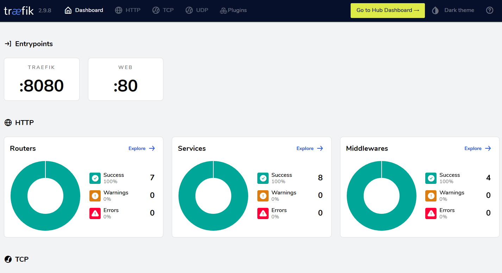

# Quarkus Microservices

## 🎯 Objective

This projects aims to be a study case for microservices using Quarkus. 

It contains three applications:
- [Election Management]: manages Election creation 
- [Voting App]: manages voting Candidates commands
- [Result App]: exposes Election voting results

## 📜 Technologies

- Language
    - [Java] 17
- Framework
    - [Quarkus]
- Testing
    - [JUnit]
    - [Testcontainers]
- ORM
    - [Hibernate]
- Migration
    - [Flyway]
- Container
    - [Docker]
- Traffic
    - [Traefik]
- Database
    - [MariaDB]
    - [Redis]
- Observability tools
    - [Graylog]
    - [OpenSearch]
    - [Jaeger Tracing]

## 🚀 Run applications

### 🎁 Build

You have to build each app, using the script [cicd-build.sh]

```bash
./cicd-build.sh election-management
./cicd-build.sh voting-app
./cicd-build.sh result-app
```
### 📦 Docker Compose
Once the apps are built, you can use Docker Compose to run all the applications and Its dependencies
```bash
TAG='docker-image-tag' docker-compose up
```

## 👨‍💻 Observability
### 👀 Logs
To access the logs through the browser, use: http://logging.private.daniellsantiago.localhost.


Default login:
- User: admin
- Password: admin

### 🔢 Telemetry
To access telemetry through the browser, use: http://telemetry.private.dio.localhost.

Default login:
- User: admin
- Password: admin

###  Traefik
To access the Traefik through the browser, use: http://localhost:8080/


[Java]: https://www.java.com/pt-BR/
[Quarkus]: https://quarkus.io/
[Docker]: https://www.docker.com/
[Traefik]: https://doc.traefik.io/traefik/
[MariaDB]: https://mariadb.org/
[Redis]: https://redis.io/
[MongoDB]: https://www.mongodb.com/pt-br
[Graylog]: https://graylog.org/
[OpenSearch]: https://opensearch.org/
[Jaeger Tracing]: https://www.jaegertracing.io/
[JUnit]: https://junit.org/junit5/
[Testcontainers]: https://testcontainers.com/
[Hibernate]: https://hibernate.org/
[Flyway]: https://flywaydb.org/

[Election Management]: https://github.com/daniellsantiago/quarkus-microservices/blob/main/election-management/README.md
[Voting App]: https://github.com/daniellsantiago/quarkus-microservices/blob/main/voting-app/README.md
[Result App]: https://github.com/daniellsantiago/quarkus-microservices/blob/main/result-app/README.md

[docker-compose.yml]: https://github.com/daniellsantiago/quarkus-microservices/blob/main/docker-compose.yml
[common.yml]: https://github.com/daniellsantiago/quarkus-microservices/blob/main/common.yml
[cicd-build.sh]: https://github.com/daniellsantiago/quarkus-microservices/blob/main/cicd-build.sh